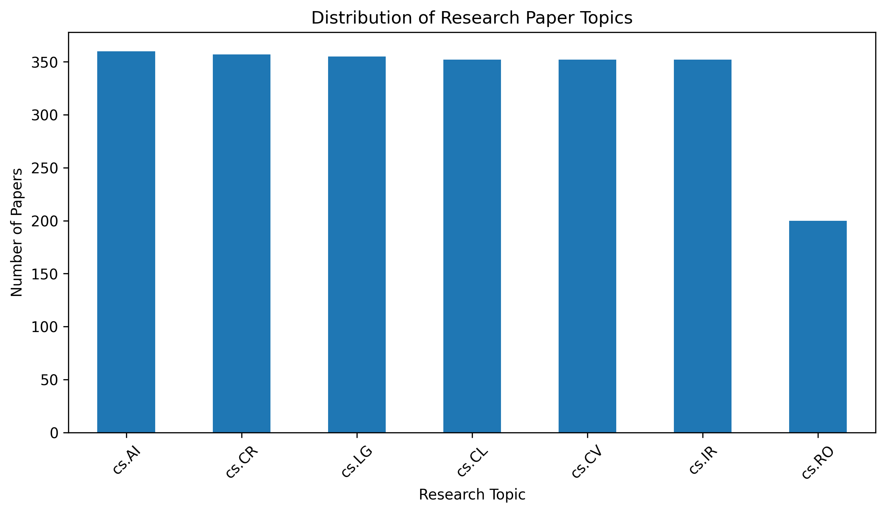
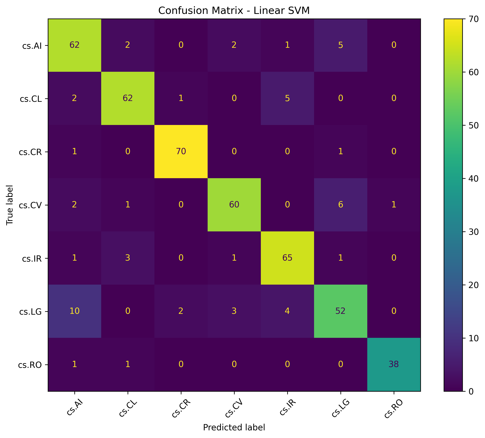

# Research Paper Topic Classifier using NLP

An NLP-based machine learning project that automatically classifies research papers into different computer science research domains using their titles and abstracts.

## Run project
<a href="https://colab.research.google.com/github/EmanFatima206/research-paper-topic-classifier/blob/main/research_paper_topic_classifier.ipynb" target="_parent">
  
</a>

## Project Overview

Research papers are published across many specialized research areas, making it difficult to manually categorize large collections of papers.

This project develops a machine learning-based text classification system that predicts the research topic of a paper based on its title and abstract.

The project uses TF-IDF for text feature extraction and compares multiple supervised machine learning algorithms.

## Research Domains

The classifier predicts papers into seven research domains:

- Artificial Intelligence
- Machine Learning
- Computer Vision
- Natural Language Processing
- Cryptography and Security
- Information Retrieval
- Robotics

## Dataset

The project uses an arXiv research paper dataset containing paper metadata, titles, abstracts, and research categories.

For this project, papers belonging to seven selected computer science categories were extracted.

After filtering and preprocessing, the final dataset contained 2,328 research papers.

### Dataset Features Used

- Title
- Summary / Abstract
- Primary Category

## Methodology

The project follows the following workflow:

1. Load the research paper dataset
2. Explore the dataset
3. Analyze research categories
4. Select relevant computer science categories
5. Remove duplicates and missing values
6. Combine paper titles and abstracts
7. Clean and preprocess text
8. Split the dataset into training and testing sets
9. Convert text into numerical features using TF-IDF
10. Train multiple machine learning models
11. Evaluate model performance
12. Compare classification models
13. Analyze the confusion matrix
14. Test the model on custom research papers
15. Save the best-performing model and TF-IDF vectorizer

## Machine Learning Models

Three classification algorithms were evaluated:

### 1. Logistic Regression

Accuracy: 86.48%

Weighted F1-score: 86.66%

### 2. Linear SVM

Accuracy: 87.77%

Weighted F1-score: 87.74%

### 3. Multinomial Naive Bayes

Accuracy: 83.69%

Weighted F1-score: 83.66%

## Results

| Model | Accuracy | Weighted F1 Score |
|---|---:|---:|
| Logistic Regression | 86.48% | 86.66% |
| Linear SVM | 87.77% | 87.74% |
| Multinomial Naive Bayes | 83.69% | 83.66% |

### Best Model

Linear SVM achieved the best overall performance with:

- Accuracy: 87.77%
- Weighted F1-score: 87.74%

## Model Evaluation

The models were evaluated using:

- Accuracy
- Precision
- Recall
- F1-score
- Confusion Matrix

## Results Visualization

### Category Distribution



### Model Comparison


### Confusion Matrix



## Example Predictions

The final Linear SVM model was tested using custom research paper titles and abstracts.

### Example 1

Input:

> Deep Learning for Medical Image Classification

Predicted Topic:

> Computer Vision

### Example 2

Input:

> Transformer Based Text Summarization

Predicted Topic:

> Natural Language Processing

## Project Files

```text
Research_Paper_Topic_Classifier.ipynb
research_topic_classifier.pkl
tfidf_vectorizer.pkl
requirements.txt
README.md
results/
